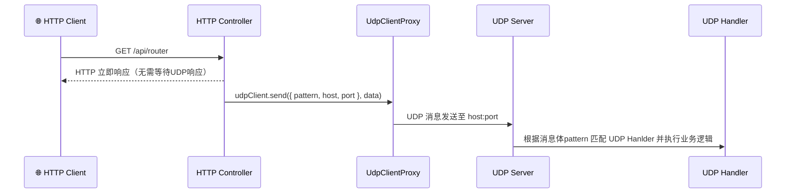
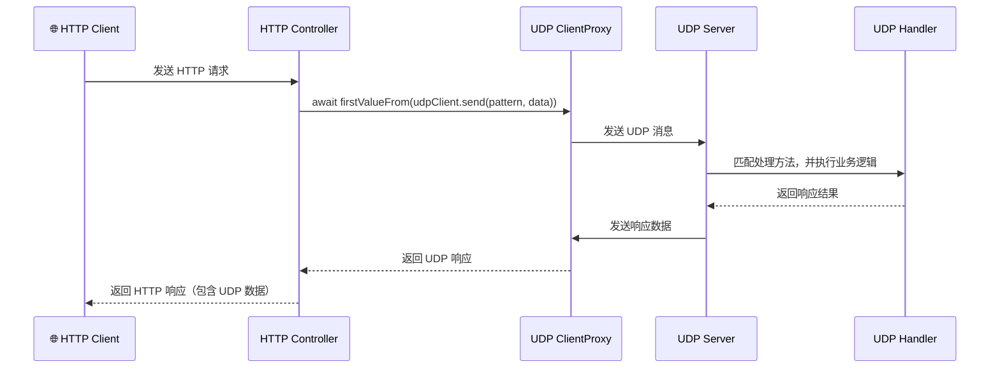
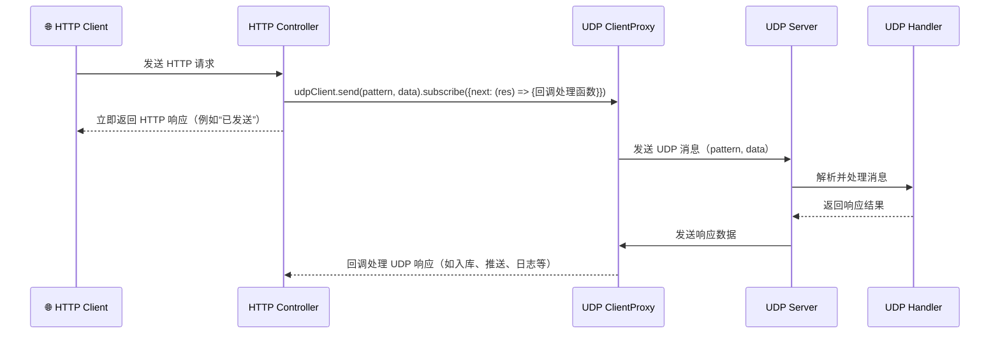

[](https://www.npmjs.com/package/nestjs-udp) [](LICENSE)

> NestJS UDP 通信模块：在 Nest 应用中以微服务方式集成 UDP 协议通信，支持路由匹配、响应式处理、动态发送等特性。

# nestjs-udp

一个基于 NestJS 微服务框架的 UDP 通信模块，支持类似 `@nestjs/microservices` 的装饰器、模块封装和客户端调用方式，开箱即用，适用于嵌入式、局域网通信、边缘网关等高性能 UDP 场景。

---

## ✨ 特性概览

- 🚀 使用 Nest 风格的 `@UdpPattern()` 装饰器定义处理器
- 📦 提供标准 `UdpClientProxy` 客户端，支持同步或异步消息
- 🧩 完整的模块封装，可通过 `UdpModule.register()` 引入
- 🧠 支持 `pattern` 匹配路由，与 HTTP/RPC 风格一致
- 🔧 支持自定义 host/port、多播、socket 类型配置
- 📈 内建通信模式示意图，方便集成到主应用

---

## ⚡ 快速开始

### 安装

```bash
# 使用 npm / yarn / pnpm 安装
npm install nestjs-udp
# OR
yarn add nestjs-udp
# OR
pnpm add nestjs-udp
```

### 📦 导出内容一览

- `UdpClientProxy`：客户端实现
- `UdpServer`：服务端实现
- `UdpModule`：可注册模块
- `UdpPattern()`：装饰器
- `UDP_CLIENT`：客户端注入标识

## 使用方式

1. Nest 混合应用中，配置并启动 UDP 服务端

```ts
import { UdpServer } from "nestjs-udp";

async function bootstrap() {
  const app = await NestFactory.create(AppModule);

  app.connectMicroservice({
    strategy: new UdpServer({ port: 34567, host: "0.0.0.0" }),
  });

  await app.startAllMicroservices();
  await app.listen(3000);
}
bootstrap();
```

2. 在控制器中，使用 `@UdpPattern()` 装饰器定义处理器

```ts
import { Controller, Get } from "@nestjs/common";
import { UdpPattern, UDP_CLIENT, UdpContext } from "nestjs-udp";

@Controller()
export class AppController {
  constructor(
    private readonly appService: AppService,
    // 注入UdpClientProxy 客户端， 用于发送UDP消息
    @Inject(UDP_CLIENT) private readonly udpClient: ClientProxy
  ) {}
  // 定义pattern为udp:ping的函数
  // @Payload() data: any 为消息负载
  // @Ctx() ctx: UdpContext 为UdpContext实例，包含目标地址信息
  // 返回值作为响应
  @UdpPattern("UDP:ping")
  ping(data: any) {
    return {
      data,
    };
  }

  // 函数无返回值则不返回响应
  @MessagePattern("UDP:noResponse")
  pingResponse(@Payload() data: any, @Ctx() ctx: UdpContext) {
    console.log("no response", data);
  }

  @Get("await")
  async pingUdp() {
    // this.udpClient.send 返回一个 Observable
    // 可使用 RxJS 操作符处理响应
    // 调用本机UDP服务，同步等待响应
    const res = await firstValueFrom(
      this.udpClient.send({ cmd: "UDP:ping" }, "hello world")
    );
    return res;
  }

  @Get("async")
  async pingAsync() {
    // 不同步等待响应，异步发送，不处理响应
    // 动态指定目标地址
    this.udpClient
      .send({ cmd: "UDP:ping", host: "127.0.0.1", port: 43210 }, "balabala")
      .subscribe();

    return "发送成功";
  }

  @Get("async-awit")
  async pingAsyncAwait() {
    // 不同步等待响应，异步发送，异步处理
    // 动态指定目标地址
    this.udpClient.send({ cmd: "UDP:ping" }, "balabala").subscribe({
      next: (res) => {
        console.log("响应", res);
      },
      error: (err) => {
        console.log("错误", err);
      },
      complete: () => {
        console.log("完成");
      },
    });

    return "发送成功";
  }
}
```

## 消息格式说明

### 发送消息结构

```ts
interface UdpPacket {
  pattern: string | { cmd: string; host?: string; port?: number };
  data: any;
}
```

- `pattern`：可为字符串（如 `"UDP:ping"`），用于常规静态路由；也可为对象（如 `{ cmd: 'UDP:ping', host: '127.0.0.1', port: 12345 }`）以实现动态目标路由功能。
- `data`：消息负载。

### 响应消息结构

服务端返回 JSON 格式数据，`data` 字段包含业务响应内容。

### 传输格式

#### 统一通过 JSON 字符串发送，格式：

> `pattern.host`与`pattern.port`为可选字段，用于动态指定目标地址。

1. 字符串

```json
{
  "pattern": "UDP:ping",
  "data": {
    "payload": "..."
  }
}
```

2. 对象

```json
{
  "pattern": { "cmd": "UDP:ping", "host": "127.0.0.1", "port": 43210 },
  "data": "some payload"
}
```

## 通讯时序图

### UDP 无返回，仅发送消息



### 同步等待 UDP 响应



### HTTP 同步响应，UDP 异步响应集成场景



## TODO: 扩展与定制

- [ ] 可增加消息加密和认证机制，保障安全性。
- [ ] 集成心跳检测和超时重试策略。
- [ ] 添加消息队列，支持消息持久化。

## ❤️ 鸣谢

本项目灵感来源于 @nestjs/microservices 模块，感谢 NestJS 团队提供的强大架构支持。
