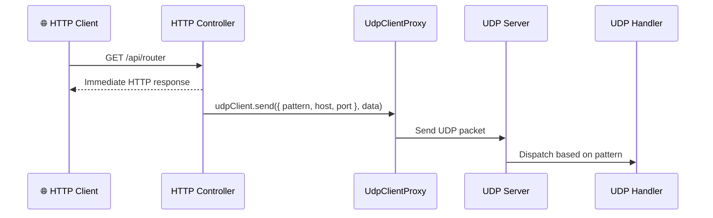
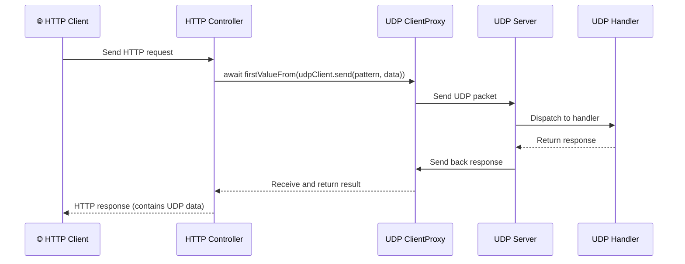
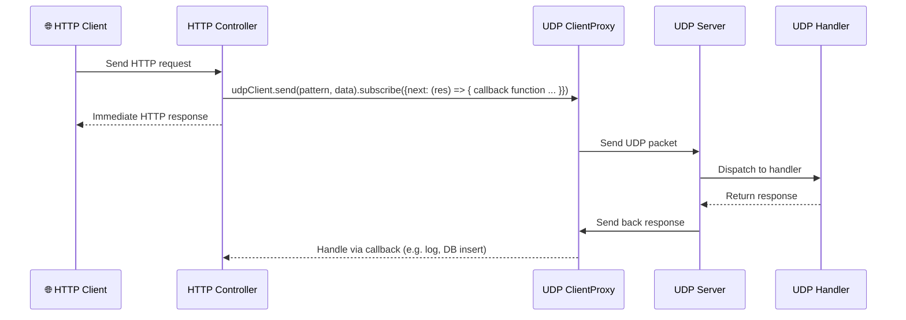

[](https://www.npmjs.com/package/nestjs-udp) [](LICENSE)

> NestJS UDP Communication Module — Seamlessly integrate UDP protocol into your Nest application with routing, reactive response handling, and dynamic targeting.

# nestjs-udp

A high-performance UDP communication module based on the NestJS microservices framework. It offers a decorator-driven, modular, and client-friendly experience similar to @nestjs/microservices. Ideal for embedded systems, LAN communication, edge gateways, and other lightweight UDP scenarios.

---

## ✨ Features

- 🚀 Define handlers using Nest-style @UdpPattern() decorators
-
- 📦 Built-in UdpClientProxy supporting both sync and async messaging
-
- 🧩 Fully modular — import via UdpModule.register()
-
- 🧠 Pattern-based routing, consistent with HTTP/RPC style
-
- 🔧 Configurable host, port, multicast, and socket type
-
- 📈 Built-in sequence diagrams to illustrate common use cases

---

## ⚡ Quick Start

### Installation

```bash
# With npm / yarn / pnpm
npm install nestjs-udp
# OR
yarn add nestjs-udp
# OR
pnpm add nestjs-udp
```

### 📦 Exports Overview

- `UdpClientProxy`: UDP client implementation
- `UdpServer`: UDP server strategy
- `UdpModule`: Registerable NestJS module
- `UdpPattern()`: Request pattern decorator
- `UDP_CLIENT`: Injection token for the client

## Usage

1. Register and start the UDP server

```ts
import { UdpServer } from "nestjs-udp";

async function bootstrap() {
  const app = await NestFactory.create(AppModule);

  app.connectMicroservice({
    strategy: new UdpServer({ port: 34567, host: "0.0.0.0" }),
  });

  await app.startAllMicroservices();
  await app.listen(3000);
}
bootstrap();
```

2. Define handlers with decorators

```ts
import { Controller, Get } from "@nestjs/common";
import { UdpPattern, UDP_CLIENT, UdpContext } from "nestjs-udp";

@Controller()
export class AppController {
  constructor(
    // 注入UdpClientProxy 客户端， 用于发送UDP消息
    @Inject(UDP_CLIENT) private readonly udpClient: ClientProxy
  ) {}
  // 定义pattern为udp:ping的函数
  // @Payload() data: any 为消息负载
  // @Ctx() ctx: UdpContext 为UdpContext实例，包含目标地址信息
  // 返回值作为响应
  @UdpPattern("UDP:ping")
  ping(data: any) {
    return {
      data,
    };
  }

  // 函数无返回值则不返回响应
  @MessagePattern("UDP:noResponse")
  pingResponse(@Payload() data: any, @Ctx() ctx: UdpContext) {
    console.log("no response", data);
  }

  @Get("await")
  async pingUdp() {
    // this.udpClient.send 返回一个 Observable
    // 可使用 RxJS 操作符处理响应
    // 调用本机UDP服务，同步等待响应
    const res = await firstValueFrom(
      this.udpClient.send({ cmd: "UDP:ping" }, "hello world")
    );
    return res;
  }

  @Get("async")
  async pingAsync() {
    // 不同步等待响应，异步发送，不处理响应
    // 动态指定目标地址
    this.udpClient
      .send({ cmd: "UDP:ping", host: "127.0.0.1", port: 43210 }, "balabala")
      .subscribe();

    return "发送成功";
  }

  @Get("async-awit")
  async pingAsyncAwait() {
    // 不同步等待响应，异步发送，异步处理
    // 动态指定目标地址
    this.udpClient.send({ cmd: "UDP:ping" }, "balabala").subscribe({
      next: (res) => {
        console.log("响应", res);
      },
      error: (err) => {
        console.log("错误", err);
      },
      complete: () => {
        console.log("完成");
      },
    });

    return "发送成功";
  }
}
```

## Message Structure

### Outgoing Message

```ts
interface UdpPacket {
  pattern: string | { cmd: string; host?: string; port?: number };
  data: any;
}
```

- `pattern`: Can be a simple string (e.g., "UDP:ping") or an object with dynamic target (host, port)
- `data`: The payload being sent

### Response Structure

All responses are JSON-encoded. The data field contains the application-level result.

### Transmission Format

#### All UDP messages are serialized to JSON strings:

> `pattern.host`与`pattern.port`为可选字段，用于动态指定目标地址。

1. Static target:

```json
{
  "pattern": "UDP:ping",
  "data": {
    "payload": "..."
  }
}
```

2. Dynamic target:

```json
{
  "pattern": { "cmd": "UDP:ping", "host": "127.0.0.1", "port": 43210 },
  "data": "some payload"
}
```

## 📊 Sequence Diagrams

### Fire-and-forget UDP (no response expected)



### Awaiting UDP Response



### HTTP Response Immediately, UDP Processed Later



## 📌 TODOs & Roadmap

- [ ] Add optional message encryption and authentication
- [ ] Integrate heartbeat and retry mechanisms
- [ ] Add message queue for persistence support

## ❤️ Acknowledgements

Inspired by the @nestjs/microservices module. Thanks to the NestJS team for their fantastic architecture and open-source contribution.
